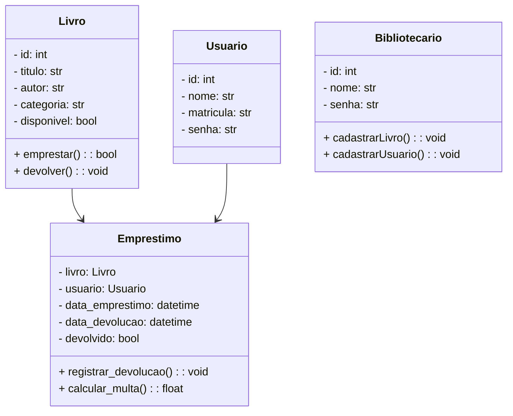

# Diagrama de Classes

```mermaid
classDiagram
    class Livro {
        - id: int
        - titulo: str
        - autor: str
        - categoria: str
        - disponivel: bool
        + emprestar(): bool
        + devolver(): void
    }

    class Usuario {
        - id: int
        - nome: str
        - matricula: str
        - senha: str
    }

    class Emprestimo {
        - livro: Livro
        - usuario: Usuario
        - data_emprestimo: datetime
        - data_devolucao: datetime
        - devolvido: bool
        + registrar_devolucao(): void
        + calcular_multa(): float
    }

    class Bibliotecario {
        - id: int
        - nome: str
        - senha: str
        + cadastrarLivro(): void
        + cadastrarUsuario(): void
    }

    Livro --> Emprestimo
    Usuario --> Emprestimo
```
