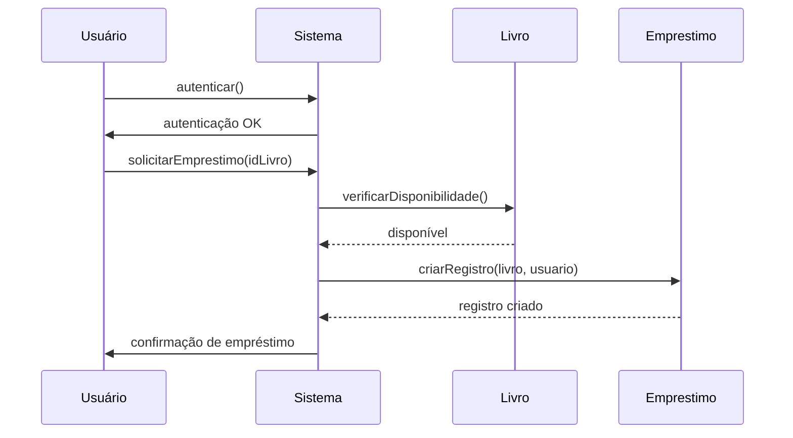

# Diagrama de Sequência

```mermaid
sequenceDiagram
    participant U as Usuário
    participant S as Sistema
    participant L as Livro
    participant E as Emprestimo

    U->>S: autenticar()
    S->>U: autenticação OK

    U->>S: solicitarEmprestimo(idLivro)
    S->>L: verificarDisponibilidade()
    L-->>S: disponível
    S->>E: criarRegistro(livro, usuario)
    E-->>S: registro criado
    S->>U: confirmação de empréstimo
```
